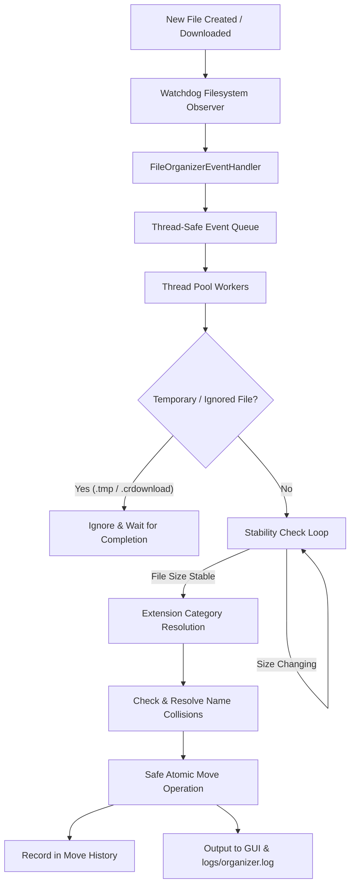

# Automated Desktop & Downloads File Organizer

[](https://www.python.org/)
[](LICENSE)
[](https://github.com/microsoft/pyright)
[](https://docs.pytest.org/)
[]()

A lightweight, robust, and continuous background file organizer built in Python. It automatically monitors any designated directory (such as your **Desktop**, **Downloads**, or custom test folder) and neatly sorts loose files into categorized folders based on file types in real-time.

Features a modern **Graphical User Interface (GUI)**, **1-Click batch sweep**, **file stability verification** (to avoid moving partial downloads), **collision-free duplicate renaming**, and full **Undo / Revert history**.

---

## Table of Contents

- [🚀 Quick Start (Easiest Way)](#-quick-start-easiest-way)
- [✨ Key Features](#-key-features)
- [🏗️ System Architecture](#️-system-architecture)
- [📁 Repository Structure](#-repository-structure)
- [💻 Installation & Manual Setup](#-installation--manual-setup)
- [🖥️ How to Use](#️-how-to-use)
  - [1. Using the Graphical Interface (GUI)](#1-using-the-graphical-interface-gui)
  - [2. Using the Command Line Interface (CLI)](#2-using-the-command-line-interface-cli)
  - [3. Running Continuously in the Background](#3-running-continuously-in-the-background)
- [⚙️ Configuration Guide (`config.json`)](#️-configuration-guide-configjson)
- [🛡️ Safety Guarantees & Revert System](#️-safety-guarantees--revert-system)
- [🧪 Running the Test Suite](#-running-the-test-suite)
- [❓ Troubleshooting & FAQ](#-troubleshooting--faq)
- [🤝 Contributing Guidelines](#-contributing-guidelines)
- [👤 Author & Project Owner](#-author--project-owner)
- [📜 License](#-license)

---

## 🚀 Quick Start (Easiest Way)

You do **not** need complex setup commands. 

1. **Clone the repository**:
   ```bash
   git clone https://github.com/subediSanjok/Automated-Desktop-File-Organizer.git
   cd Automated-Desktop-File-Organizer
   ```
2. **Double-Click `Start_Organizer_GUI.bat`**:
   - Automatically detects Python.
   - Automatically sets up a local virtual environment (`venv`).
   - Automatically installs required dependencies (`watchdog`, `pytest`).
   - Opens the Desktop Organizer GUI instantly!

---

## ✨ Key Features

- 🖥️ **Modern Desktop GUI**: Fast, responsive dashboard with 1-click presets for Desktop and Downloads, live event streams, statistics counter, and settings manager.
- 📂 **Continuous Event-Driven Monitoring**: Leverages native filesystem notifications via Python `watchdog` instead of CPU-heavy polling loops.
- ⚡ **1-Click Batch Sweep ("Organize Now")**: Instant sweep and organization of existing loose files in any target directory.
- ⏳ **Download Stability Detection**: Intelligently verifies file size stability over configurable time intervals before moving, preventing incomplete browser downloads or active file writes from corrupting.
- 🔀 **Zero-Loss Duplicate Renaming**: Appends incremental numbering (`report_1.pdf`, `report_2.pdf`) so existing files are never overwritten.
- 🛡️ **Temporary & System File Filter**: Automatically ignores `.crdownload`, `.part`, `.tmp`, and hidden system files until download completion.
- 📁 **Dynamic Category Creation**: Automatically creates destination folders (`Documents/`, `Images/`, `Videos/`, `Audio/`, `Archives/`, `Code/`, `Others/`) as needed.
- ⏪ **Undo & Full Directory Revert**: Tracked history manager allows single-batch rollback or sweeping all files back to the root directory with empty folder cleanup.
- ⚡ **Multi-Threaded Worker Pool**: Concurrent background task workers ensure non-blocking event processing during large file transfers.
- 📝 **Centralized UTF-8 Logging**: Real-time log stream visible in GUI and saved locally to `logs/organizer.log`.

---

## 🏗️ System Architecture



---

## 📁 Repository Structure

```text
Automated-Desktop-File-Organizer/
│
├── src/                               # Application Source Code
│   ├── __init__.py                    # Package marker
│   ├── config.py                      # Dataclasses, JSON loader/saver, presets
│   ├── file_utils.py                  # Extension normalization, unique naming, safe moves
│   ├── gui.py                         # Tkinter GUI application & event log viewer
│   ├── history.py                     # Move history persistence & revert tracking
│   ├── logger.py                      # UTF-8 multi-handler logger (Console + File)
│   ├── main.py                        # CLI entry point with graceful signal handling
│   ├── organizer.py                   # File categorization, stability check, move engine
│   └── watcher.py                     # Watchdog directory observer & worker thread pool
│
├── tests/                             # Automated Test Suite (33 Passing Tests)
│   ├── test_config.py                 # Unit tests for config parsing & path resolution
│   ├── test_file_utils.py             # Unit tests for unique names & safe move logic
│   ├── test_gui.py                    # Unit tests for GUI components & presets
│   ├── test_organizer.py              # Integration tests for categorization & collisions
│   ├── test_revert.py                 # Integration tests for batch undo & full revert
│   └── live_verification.py           # Interactive end-to-end sandbox tester
│
├── logs/                              # Execution logs & history directory
│   └── .gitkeep                       # Git directory placeholder (logs are git-ignored)
│
├── config.json                        # Default JSON configuration file
├── pyrightconfig.json                 # Pyright / Pylance static type checker configuration
├── requirements.txt                   # Production and testing dependencies
├── run_gui.py                         # Python launcher script for GUI
├── Start_Organizer_GUI.bat            # 1-Click portable launcher for Windows
├── CONTRIBUTING.md                    # Guidelines for contributing & reporting issues
├── README.md                          # Comprehensive project documentation
├── .gitignore                         # Git exclusion rules
└── LICENSE                            # MIT License
```

---

## 💻 Installation & Manual Setup

If you prefer running via command line instead of the `.bat` file:

### 1. Prerequisites
- **Python 3.10 or higher** installed.

### 2. Setup Virtual Environment
```bash
# Clone the repo
git clone https://github.com/subediSanjok/Automated-Desktop-File-Organizer.git
cd Automated-Desktop-File-Organizer

# Create virtual environment
python -m venv venv

# Activate on Windows (PowerShell)
.\venv\Scripts\Activate.ps1

# Activate on Windows (Command Prompt)
venv\Scripts\activate.bat

# Activate on macOS / Linux
source venv/bin/activate
```

### 3. Install Dependencies
```bash
pip install -r requirements.txt
```

---

## 🖥️ How to Use

### 1. Using the Graphical Interface (GUI)

Launch the GUI using:
```bash
python run_gui.py
```
*(Or double-click `Start_Organizer_GUI.bat`)*

**In the GUI you can:**
- Click **"Desktop"** or **"Downloads"** for instant preset directory selection.
- Click **"Organize Now (Sweep)"** to immediately organize all loose files in the folder.
- Click **"Start Monitoring"** to run continuous real-time background organization.
- View real-time operation logs and statistics in the built-in console window.
- Click **"Undo Last Batch"** to reverse the latest organization operation.
- Edit categories and file extensions live in the **"Settings & Rules"** tab.

---

### 2. Using the Command Line Interface (CLI)

Run the CLI organizer directly:
```bash
# Run with default config (config.json)
python -m src.main

# Run specifying a custom config file
python -m src.main --config path/to/custom_config.json

# Run in test/debug mode
python -m src.main --test
```

---

### 3. Running Continuously in the Background

To run silently in the background on Windows without a terminal window:
```powershell
Start-Process -WindowStyle Hidden "venv\Scripts\pythonw.exe" -ArgumentList "run_gui.py"
```

---

## ⚙️ Configuration Guide (`config.json`)

The application is fully customizable via `config.json`:

```json
{
    "watch_directory": "C:\\FileOrganizerTest",
    "default_category": "Others",
    "ignored_extensions": [
        ".tmp",
        ".crdownload",
        ".part",
        ".download",
        ".partial"
    ],
    "stability": {
        "check_interval_seconds": 1.0,
        "stable_checks": 3,
        "max_retries": 15
    },
    "categories": {
        "Documents": [".pdf", ".docx", ".doc", ".txt", ".xlsx", ".pptx", ".csv"],
        "Images": [".jpg", ".jpeg", ".png", ".gif", ".svg", ".webp", ".ico"],
        "Videos": [".mp4", ".mkv", ".mov", ".avi", ".flv", ".webm"],
        "Audio": [".mp3", ".wav", ".aac", ".flac", ".ogg", ".m4a"],
        "Archives": [".zip", ".rar", ".7z", ".tar", ".gz", ".iso"],
        "Code": [".py", ".js", ".html", ".css", ".json", ".cpp", ".java", ".ts"],
        "Executables": [".exe", ".msi", ".bat", ".cmd", ".ps1"]
    }
}
```

### Configuration Parameters:
- `watch_directory`: Absolute path of the folder to monitor and organize.
- `default_category`: Folder name where files with unmatched extensions are placed (`Others`).
- `ignored_extensions`: List of extension patterns to completely skip until completed.
- `stability.check_interval_seconds`: Wait duration between file size checks.
- `stability.stable_checks`: Number of consecutive identical size checks required before moving.
- `stability.max_retries`: Maximum number of checks before logging a warning and waiting.
- `categories`: Dictionary mapping category folder names to file extensions.

---

## 🛡️ Safety Guarantees & Revert System

1. **Zero Data Deletion**: Files are strictly moved using atomic filesystem operations; files are never deleted.
2. **Duplicate Protection**: If a file named `invoice.pdf` already exists in `Documents/`, the new file is safely moved as `invoice_1.pdf`.
3. **Subfolder Loop Prevention**: Monitored subdirectories (e.g. `Documents/`, `Images/`) are filtered out so they never trigger recursive organizational loops.
4. **Revert / Rollback Support**:
   - **Undo Batch**: Restores files organized during the last session back to their original location.
   - **Revert Directory**: Sweeps all files from category subfolders back to the root folder and automatically prunes empty category folders.

---

## 🧪 Running the Test Suite

The project includes an extensive test suite covering configuration, file utilities, duplicate handling, stability verification, GUI components, and revert mechanics.

Run all tests via pytest:
```bash
pytest
```

Run static type checking with Pyright:
```bash
npx pyright
```

---

## ❓ Troubleshooting & FAQ

### 1. `PermissionError` when moving files
- **Cause**: An application (such as Adobe Acrobat, Word, or an active torrent/browser download) has locked the file.
- **Solution**: Once the program finishes writing or is closed, the organizer processes the file on the next change event.

### 2. Can I use this on multiple laptops?
- **Yes.** Simply clone or copy the folder to any Windows laptop with Python installed and double-click `Start_Organizer_GUI.bat`. It handles virtual environment creation and package installation automatically.

### 3. How do I organize my real Windows Downloads folder?
- Open the GUI and click the **"Downloads"** preset button, then click **"Start Monitoring"** or **"Organize Now"**.

---

## 🤝 Contributing Guidelines

Contributions are welcome! If you would like to contribute:
1. Fork the repository.
2. Create a feature branch (`git checkout -b feature/AmazingFeature`).
3. Ensure all tests pass (`pytest`).
4. Commit your changes (`git commit -m 'Add some AmazingFeature'`).
5. Push to the branch (`git push origin feature/AmazingFeature`).
6. Open a Pull Request.

Please see [CONTRIBUTING.md](CONTRIBUTING.md) for full details.

---

## 👤 Author & Project Owner

**Sanjok Subedi**  
- **GitHub**: [@subediSanjok](https://github.com/subediSanjok)  
- **Project Repository**: [Automated-Desktop-File-Organizer](https://github.com/subediSanjok/Automated-Desktop-File-Organizer)

---

## 📜 License

This project is licensed under the **MIT License** — see the [LICENSE](LICENSE) file for details.
