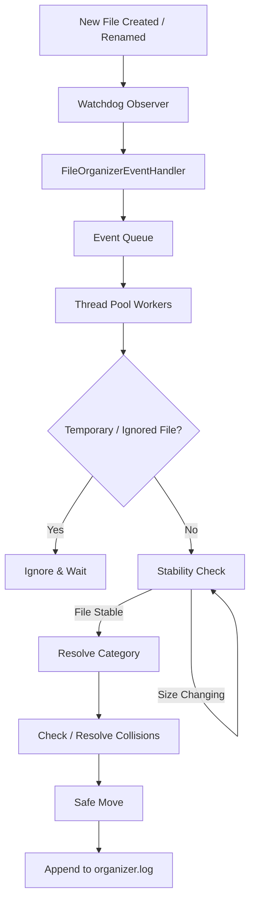

# Automated Desktop File Organizer

A lightweight, robust, and continuous background file organizer built in Python using Watchdog. It automatically monitors a designated directory (such as `C:\FileOrganizerTest` or your Windows `Downloads` folder) and neatly sorts incoming files into categorized subfolders based on file extensions.

---

## Table of Contents

- [Features](#features)
- [Project Architecture](#project-architecture)
- [Requirements](#requirements)
- [Installation & Virtual Environment](#installation--virtual-environment)
- [Configuration Guide](#configuration-guide)
- [How to Run](#how-to-run)
- [Running in Background on Windows](#running-in-background-on-windows)
- [How to Switch to Real Downloads Directory](#how-to-switch-to-real-downloads-directory)
- [Testing](#testing)
- [Safety Guarantees](#safety-guarantees)
- [Troubleshooting](#troubleshooting)
- [License](#license)

---

## Features

- 🖥️ **Modern Desktop & Downloads GUI**: Intuitive, responsive dashboard with 1-click presets for Desktop and Downloads, live event stream, and settings editor.
- 📂 **Continuous Event-Driven Monitoring**: Uses Watchdog filesystem events (`on_created`, `on_moved`) instead of polling or high-CPU scanning.
- ⚡ **Instant Batch Sweep**: One-click button in GUI to immediately organize existing loose files in any target directory.
- ⏳ **Download Completion & Stability Detection**: Intelligently inspects file size stability over configurable intervals to ensure partially downloaded or written files are never moved prematurely.
- 🔀 **Collision-Free Duplicate Handling**: Appends incremental suffix numbers (`report_1.pdf`, `report_2.pdf`) so existing files are never overwritten.
- 🛡️ **Temporary File Filter**: Automatically ignores `.crdownload`, `.part`, `.tmp`, and other active browser temporary download files until completion.
- 📁 **Automated Folder Creation**: Seamlessly creates missing category folders (`Documents/`, `Images/`, `Videos/`, etc.) on demand.
- ⚡ **Concurrent Event Processing**: Multi-threaded worker pool prevents event dropping and avoids blocking Watchdog during large file stability checks.
- 📝 **Centralized Logging**: Outputs detailed operation logs to both console, GUI window, and `logs/organizer.log`.
- 🛑 **Graceful Lifecycle Management**: Clean shutdown on `Ctrl+C` or GUI close with in-flight worker completion.

---

## Project Architecture

```text
automated-desktop-file-organizer/
│
├── src/
│   ├── main.py              # CLI entry point, signal handlers, lifecycle
│   ├── config.py            # Configuration loader, dataclasses, category lookup
│   ├── watcher.py           # Watchdog filesystem event observer & worker queue
│   ├── organizer.py         # Categorization, stability verification, move executor
│   ├── file_utils.py        # Unique naming, extension parsing, safe move helpers
│   └── logger.py            # Centralized UTF-8 multi-handler logger
│
├── tests/
│   ├── test_config.py       # Unit tests for config parsing and defaults
│   ├── test_file_utils.py   # Unit tests for file operations & stability
│   ├── test_organizer.py    # Integration tests for categorization & duplicate handling
│   └── live_verification.py # Live integration tester on C:\FileOrganizerTest
│
├── logs/
│   └── organizer.log        # Rolling execution logs
│
├── config.json              # Main JSON configuration file
├── requirements.txt         # Package dependencies
├── README.md                # Comprehensive documentation
├── .gitignore               # Ignored artifacts and caches
└── LICENSE                  # MIT License
```



---

## Requirements

- Python 3.8+ (Tested on Python 3.13)
- Windows 10 / 11 (Supports macOS & Linux as well)

---

## Installation & Virtual Environment

1. Open PowerShell and navigate to the project directory:
   ```powershell
   cd "C:\Users\HP\Desktop\Automated Desktop File Organizer"
   ```

2. Create a Python virtual environment:
   ```powershell
   python -m venv venv
   ```

3. Activate the virtual environment:
   - **PowerShell**:
     ```powershell
     .\venv\Scripts\Activate.ps1
     ```
   - **Command Prompt**:
     ```cmd
     .\venv\Scripts\activate.bat
     ```

4. Install the required dependencies:
   ```powershell
   pip install -r requirements.txt
   ```

---

## Configuration Guide

The application is configured using `config.json`:

```json
{
    "watch_directory": "C:\\FileOrganizerTest",
    "default_category": "Others",
    "ignored_extensions": [
        ".crdownload",
        ".part",
        ".tmp"
    ],
    "stability": {
        "check_interval_seconds": 1,
        "stable_checks": 2,
        "max_retries": 5
    },
    "categories": {
        "Documents": [".pdf", ".doc", ".docx", ".txt", ".rtf"],
        "Spreadsheets": [".xls", ".xlsx", ".csv"],
        "Images": [".jpg", ".jpeg", ".png", ".gif", ".webp", ".svg"],
        "Videos": [".mp4", ".mkv", ".avi", ".mov", ".webm"],
        "Music": [".mp3", ".wav", ".flac", ".aac"],
        "Archives": [".zip", ".rar", ".7z", ".tar", ".gz"],
        "Applications": [".exe", ".msi"],
        "Code": [".py", ".js", ".jsx", ".ts", ".tsx", ".java", ".html", ".css", ".json"]
    }
}
```

### Configuration Options

| Key | Description | Default |
|---|---|---|
| `watch_directory` | Absolute path of the folder to monitor. | `C:\FileOrganizerTest` |
| `default_category` | Folder name for unsupported extensions. | `Others` |
| `ignored_extensions` | List of extensions to ignore (e.g. temporary download files). | `[".crdownload", ".part", ".tmp"]` |
| `stability.check_interval_seconds` | Seconds between consecutive file size checks. | `1` |
| `stability.stable_checks` | Number of matching size readings required to consider file ready. | `2` |
| `stability.max_retries` | Max attempts before giving up on an unstable file. | `5` |
| `categories` | Dictionary mapping folder names to extension lists. | See above |

---

## How to Run

### 🖥️ Option 1: Graphical User Interface (Recommended)

Launch the modern GUI dashboard:

```powershell
python run_gui.py
```
*(Or via module execution)*:
```powershell
python -m src.gui
```
*(Or via main CLI flag)*:
```powershell
python src\main.py --gui
```

**GUI Features:**
- 🖥️ **Quick Presets**: 1-click switch between Windows **Desktop** (`~/Desktop`) and **Downloads** (`~/Downloads`).
- ⚡ **Organize Now**: Instantly sweep and categorize all existing loose files with a progress bar.
- 🟢 **Live Watcher**: Start/Stop real-time background watchdog monitoring.
- 📂 **Rule & Category Manager**: Add custom categories, edit file extensions, and save updates directly to `config.json`.
- 📊 **Real-Time Activity Log**: Live colored activity stream and organized file count.

---

### 💻 Option 2: Command-Line Interface (CLI)

Run the organizer directly in your terminal:

```powershell
python src\main.py
```

Or with a custom configuration path:

```powershell
python src\main.py --config "path/to/custom_config.json"
```

To stop CLI monitoring, press `Ctrl + C`. The application will finish processing in-flight files and exit cleanly.

---

## Running in Background on Windows

### Method 1: Using `pythonw.exe` (No Terminal Window)

`pythonw.exe` runs Python scripts without opening a command prompt window:

```powershell
Start-Process -FilePath ".\venv\Scripts\pythonw.exe" -ArgumentList "src\main.py"
```

To stop the background process:
```powershell
Stop-Process -Name "pythonw"
```

### Method 2: Windows Task Scheduler (Start at Login)

1. Open **Task Scheduler** (`taskschd.msc`).
2. Click **Create Task...**
3. On the **General** tab:
   - Name: `Automated File Organizer`
   - Run whether user is logged on or not / Run only when user is logged on.
4. On the **Triggers** tab:
   - New -> Begin the task: **At log on**.
5. On the **Actions** tab:
   - Action: **Start a program**
   - Program/script: `C:\Users\<username>\Desktop\Automated Desktop File Organizer\venv\Scripts\pythonw.exe`
   - Add arguments: `src\main.py`
   - Start in: `C:\Users\<username>\Desktop\Automated Desktop File Organizer`
6. Click **OK**.

---

## How to Switch to Real Downloads Directory

Once you have verified the organizer with `C:\FileOrganizerTest`, switch to your Windows Downloads folder:

1. Open `config.json` in any text editor.
2. Update `"watch_directory"` with your Downloads path (remember to double-escape backslashes `\\` in JSON):

```json
{
    "watch_directory": "C:\\Users\\HP\\Downloads",
    ...
}
```

3. Save `config.json` and start the application:
```powershell
.\venv\Scripts\python src\main.py
```

---

## Testing

### Automated Unit & Integration Tests

Run the full pytest suite:

```powershell
.\venv\Scripts\pytest -v
```

### Live Test Directory Verification

Run the end-to-end live tester that creates a temporary `C:\FileOrganizerTest` directory, verifies file categorization, duplicate naming, stability checking, temporary file filtering, and cleans up:

```powershell
.\venv\Scripts\python tests\live_verification.py
```

---

## Safety Guarantees

- 🚫 **Never Deletes Files**: The application only executes safe moves (`shutil.move`).
- 🚫 **Never Overwrites Files**: If a file with the same name exists at destination, a unique index is appended (`filename_1.ext`).
- 🚫 **Never Reorganizes Subfolders**: Subdirectories inside the watch path (such as `Documents/`) are excluded from triggering organizer loops.
- 🚫 **Never Moves Incomplete Downloads**: Actively written files are checked for stability before moving.

---

## Troubleshooting

### 1. `PermissionError` when moving files
- **Cause**: An external application (like an active PDF reader, video player, or installer) has an exclusive lock on the file.
- **Resolution**: Close the application holding the lock. The organizer will process the file on the next change event.

### 2. Files not moving
- Check `logs/organizer.log` for error or warning entries.
- Ensure the extension is mapped in `config.json` or check the `Others` directory.
- Verify that `watch_directory` in `config.json` matches your monitored folder path.

---

## License

This project is licensed under the MIT License — see the [LICENSE](LICENSE) file for details.
